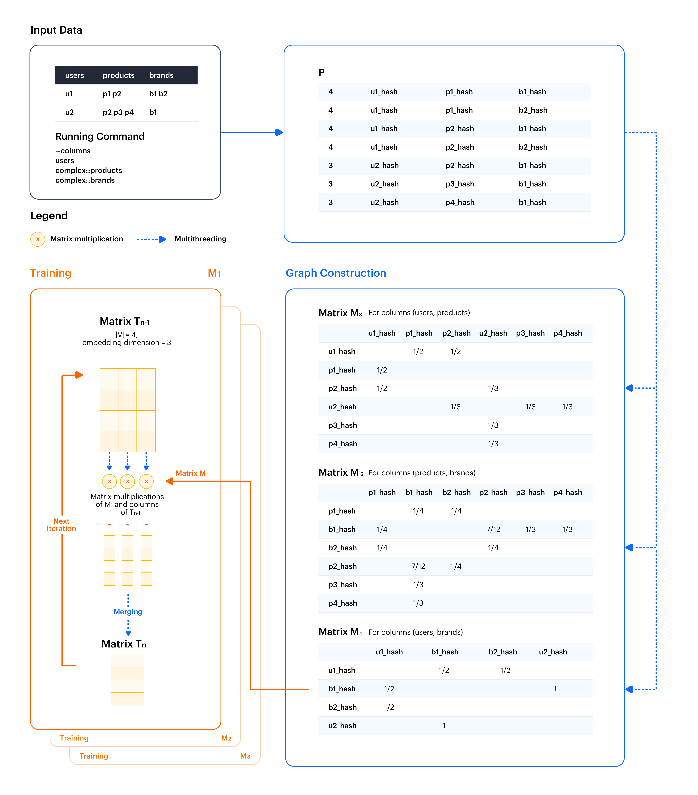

# Cleora

_**Cleora** is a genus of moths in the family **Geometridae**. Their scientific name derives from the Ancient Greek geo γῆ or γαῖα "the earth", and metron μέτρον "measure" in reference to the way their larvae, or "inchworms", appear to "**measure the earth**" as they move along in a looping fashion._

Cleora is a general-purpose model for efficient, scalable learning of stable and inductive entity embeddings for heterogeneous relational data.

**Read the whitepaper ["Cleora: A Simple, Strong and Scalable Graph Embedding Scheme"](https://arxiv.org/abs/2102.02302)**

Cleora embeds entities in *n-dimensional spherical spaces* utilizing extremely fast stable, iterative random projections, which allows for unparalleled performance and scalability.

Types of data which can be embedded include for example:
- heterogeneous undirected graphs
- heterogeneous undirected hypergraphs
- text and other categorical array data
- any combination of the above

Key competitive advantages of Cleora:
* more than **197x faster than DeepWalk**
* **~4x-8x faster than [PyTorch-BigGraph](https://ai.facebook.com/blog/open-sourcing-pytorch-biggraph-for-faster-embeddings-of-extremely-large-graphs/)** (depends on use case)
* star expansion, clique expansion, and no expansion support for hypergraphs
* **quality of results outperforming or competitive** with other embedding frameworks like [PyTorch-BigGraph](https://ai.facebook.com/blog/open-sourcing-pytorch-biggraph-for-faster-embeddings-of-extremely-large-graphs/), GOSH, DeepWalk, LINE
* can embed extremely large graphs & hypergraphs on a single machine

Embedding times - example:

<table>
<tr>
<td> <b>Algorithm</b>
<td> <b>FB dataset</b>
<td> <b>RoadNet dataset</b>
<td> <b>LiveJournal dataset</b>
</tr>

<tr>
<td> Cleora
<td> 00:00:43 h
<td> 00:21:59 h
<td> 01:31:42 h
</tr>

<tr>
<td> PyTorch-BigGraph
<td> 00:04.33 h
<td> 00:31:11 h
<td> 07:10:00 h
</tr>

</table>

Link Prediction results - example:
<table>
  <tr>
    <td>
    <!-- <td rowspan="2">&nbsp;</td> -->
    <td colspan="2"><b>FB dataset</b></td>
    <td colspan="2"><b>RoadNet dataset</b></td>
    <td colspan="2"><b>LiveJournal dataset</b></td>
  </tr>
  <tr>
    <td> <b>Algorithm</b>
    <td> <b>MRR</b>
    <td> <b>HitRate@10</b>
    <td> <b>MRR</b>
    <td> <b>HitRate@10</b>
    <td> <b>MRR</b>
    <td> <b>HitRate@10</b>
  </tr>
  <tr>
    <td> Cleora
    <td> 0.072
    <td> 0.172
    <td> 0.929
    <td> 0.942
    <td> 0.586
    <td> 0.627
  </tr>
  <tr>
  <td> PyTorch-BigGraph
  <td> 0.035
  <td> 0.072
  <td> 0.850
  <td> 0.866
  <td> 0.565
  <td> 0.672
  </tr>

  <!-- <tr>
  <td> LINE
  <td> 0.075
  <td> 0.192
  <td> 0.962
  <td> 0.983
  <td> 0.553
  <td> 0.648
  </tr> -->
</table>

## Cleora design principles
Cleora is built as a multi-purpose "just embed it" tool, suitable for many different data types and formats.

Cleora ingests a relational table of rows representing a typed and undirected heterogeneous hypergraph, which can contain multiple:
- typed categorical columns
- typed categorical array columns

For example a relational table representing shopping baskets may have the following columns:

    user <\t> product <\t> store

With the input file containing values:

    user_id <\t> product_id product_id product_id <\t> store_id

Every column has a type, which is used to determine whether spaces of identifiers between different columns are shared or distinct. It is possible for two columns to share a type, which is the case for homogeneous graphs:

    user <\t> user

Based on the column format specification, Cleora performs:
 - Star decomposition of hyper-edges
 - Creation of pairwise graphs for all pairs of entity types
 - Embedding of each graph

The final output of Cleora consists of multiple files for each (undirected) pair of entity types in the table.

Those embeddings can then be utilized in a novel way thanks to their dim-wise independence property, which is described further below.

## Key technical features of Cleora embeddings
The embeddings produced by Cleora are different from those produced by Node2vec, Word2vec, DeepWalk or other systems in this class by a number of key properties:
 - **efficiency** - Cleora is two orders of magnitude faster than Node2Vec or DeepWalk
 - **inductivity** - as Cleora embeddings of an entity are defined only by interactions with other entities, vectors for new entities can be computed on-the-fly
 - **updatability** - refreshing a Cleora embedding for an entity is a very fast operation allowing for real-time updates without retraining
 - **stability** - all starting vectors for entities are deterministic, which means that Cleora embeddings on similar datasets will end up being similar. Methods like Word2vec, Node2vec or DeepWalk return different results with every run.
 - **cross-dataset compositionality** - thanks to stability of Cleora embeddings, embeddings of the same entity on multiple datasets can be combined by averaging, yielding meaningful vectors
 - **dim-wise independence** - thanks to the process producing Cleora embeddings, every dimension is independent of others. This property allows for efficient and low-parameter method for combining multi-view embeddings with Conv1d layers.
 - **extreme parallelism and performance** - Cleora is written in Rust utilizing thread-level parallelism for all calculations except input file loading. In practice this means that the embedding process is often faster than loading the input data.

## Key usability features of Cleora embeddings

The technical properties described above imply good production-readiness of Cleora, which from the end-user perspective can be summarized as follows:
- heterogeneous relational tables can be embedded without any artificial data pre-processing
- mixed interaction + text datasets can be embedded with ease
- cold start problem for new entities is non-existent
- real-time updates of the embeddings do not require any separate solutions
- multi-view embeddings work out of the box
- temporal, incremental embeddings are stable out of the box, with no need for re-alignment, rotations or other methods
- extremely large datasets are supported and can be embedded within seconds / minutes

## Data formats supported by Cleora

Cleora supports 2 input file formats:
 - TSV (tab-separated values)
 - JSON

For TSV datasets containing composite fields (categorical array), multiple items within a field are then separated by space.

The specification of an input format is as follows:

    --columns="[column modifiers, ::]<column_name> [column modifiers, ::]<column_name> [column modifiers, ::]<column_name> ..."

The allowed column modifiers are:
 - *transient* - the field is virtual - it is considered during embedding process, no entity is written for the column
 - *complex* - the field is composite, containing multiple entity identifiers separated by space in TSV or an array in JSON
 - *reflexive* - the field is reflexive, which means that it interacts with itself, additional output file is written for every such field
 - *ignore* - the field is ignored, no output file is written for the field

Allowed combinations of modifiers are:
- `transient`
- `complex`
- `transient::complex`
- `reflexive::complex`

Combinations which don't make sense are:
- `reflexive` - this would represent an identity relation
- `transient::reflexive` - this would generate no output
- `reflexive::transient::complex` - this would generate no output

## Running

One can download binary from [releases](https://github.com/Synerise/cleora/releases) or build oneself. See **Building** section below.

Command line options (for more info use `--help` as program argument):

    -i --input (name of the input file)
    -t --type (type of the input file)
    -o --output-dir (output directory for files with embeddings)
    -r --relation-name (name of the relation, for output filename generation)
    -d --dimension (number of dimensions for output embeddings)
    -n --number-of-iterations (number of iterations for the algorithm, usually 3 or 4 works well)
    -c --columns (column format specification)
    -p --prepend-field-name (prepend field name to entity in output)
    -l --log-every-n (log output every N lines)
    -e --in-memory-embedding-calculation (calculate embeddings in memory or with memory-mapped files)
    -f --output-format (either textfile (default) or numpy)

An example input file for Cleora (stored in `files/samples/edgelist_1.tsv`):

    a ba bac <\t> abb <\t> r rrr rr
    a ab bca <\t> bcc <\t> rr r
    ba ab a aa <\t> abb <\t> r rrr

An example of how to run Cleora in order to calculate embeddings:

    ./cleora -i files/samples/edgelist_1.tsv --columns="complex::reflexive::a b complex::c" -d 128 -n 4 --relation-name=just_a_test -p 0

It generates the following output files for textfile:

	just_a_test__a__a.out
	just_a_test__a__b.out
	just_a_test__a__c.out
	just_a_test__b__c.out

containing embedding vectors for respective pairs of columns.

For numpy output format each pair of embedded entities is stored in three
files: .entities a list of entities in json format, .npy a numpy array
containing embeddings, .occurences numpyarray containing entities occurence
counts.

	just_a_test__a__a.out{.entities, .npy, .occurences}
	just_a_test__a__b.out{.entities, .npy, .occurences}
	just_a_test__a__c.out{.entities, .npy, .occurences}
	just_a_test__b__c.out{.entities, .npy, .occurences}

## Building

- Install Rust - https://www.rust-lang.org/tools/install
- execute `cargo build --release`

# More details

## Algorithm

**Hypergraph Expansion.** 
Cleora needs to break down all existing hyperedges into edges as the algorithm relies on the pairwise 
notion of node transition. Hypergraph expansion to graph is done using two alternative strategies:
- `Clique Expansion` - each hyperedge is transformed into a clique - a subgraph where each pair of nodes is connected with an edge. 
Space/time complexity of this approach is `O(|V| x d + |E| x k^2)` where `|E|` is the number of hyperedges. With the usage of cliques 
the number of created edges can be significant but guarantees better fidelity to the original hyperedge relationship. We apply 
this scheme to smaller graphs.
- `Star Expansion` - an extra node is introduced which links to the original nodes contained by a hyperedge. 
Space/time complexity of this approach is `O((|V|+|E|) x d + |E|k)`. Here we must count in the time and space needed to embed 
an extra entity for each hyperedge, but we save on the number of created edges, which would be only `k` for each hyperedge. 
This approach is suited for large graphs.

## Implementation
Cleora is implemented in Rust in a highly parallel architecture, using multithreading and adequate data arrangement for fast CPU access. 
We exemplify the embedding procedure in Figure, using a very general example of multiple relations in one graph.

For maximum efficiency we created a custom implementation of a sparse matrix data structure - the `SparseMatrix` struct. 
It follows the sparse matrix coordinate format (COO). Its purpose is to save space by holding only the coordinates and values of nonzero entities.

Embedding is done in 2 basic steps: graph construction and training.

Let's assume that the basic configuration of the program looks like this:
    
    --input files/samples/edgelist_2.tsv --columns="users complex::products complex::brands" --dimension 3 --number-of-iterations 4

Every SparseMatrix is created based on the program argument `--columns`. For our example, there will be three SparseMatrix'es that will only read data from the columns:
- users and brands by M1
- products and brands by M2
- users and products by M3

**Graph construction**
Graph construction starts with the creation of a helper matrix `P` object as a regular 2-D Rust array, which is built according to the selected 
expansion method. An example involving clique expansion is presented in Figure - a Cartesian product (all combinations) of all columns is created. 
Each entity identifier from the original input file is hashed with `xxhash` (https://cyan4973.github.io/xxHash/) - a fast and efficient hashing method. 
We hash the identifiers to store them in a unified, small data format. From the first line of our example:

    u1  p1 p2   b1 b2

we get 4 combinations produced by the Cartesian product:

    [4, u1_hash, p1_hash, b1_hash]
    [4, u1_hash, p1_hash, b2_hash]
    [4, u1_hash, p2_hash, b1_hash]
    [4, u1_hash, p2_hash, b2_hash]

At the beginning we insert the total number of combinations (in this case 4). Then we add another 3 rows representing combinations from the second row of the input.

Subsequently, for each relation pair from matrix `P` we create a separate matrix `M` as a `SparseMatrix` struct (the matrices `M` will usually hold mostly zeros). 
Each matrix `M` object is produced in a separate thread in a stepwise fashion. The rows of matrix `P` object are broadcasted to all matrix `M` objects, 
and each matrix `M` object reads the buffer selecting the appropriate values, updating its content.
For example, M3 (users and products) reads the hashes from indexes 1 and 2. After reading the first vector:

    [4, u1_hash, p1_hash, b1_hash]

the edge value for `u1_hash <-> p1_hash` equals 1/4 (1 divided by the total number of Cartesian products). After reading the next vector:

    [4, u1_hash, p1_hash, b2_hash]
    
the edge value for `u1_hash <-> p1_hash` updates to 1/2 (1/4 + 1/4). After reading the next two, we finally have:

    u1_hash <-> p1_hash = 1/2
    u1_hash <-> p2_hash = 1/2

**Training**
In this step training proceeds separately for each matrix `M`, so we will now refer to a single object. The matrix `M` object is multiplied by a freshly 
initialized 2-D array representing matrix `T_0`. Multiplication is done against each column of matrix `T_0` object in a separate thread. 
The obtained columns of the new matrix `T_1` object are subsequently merged into the full matrix. `T_1` object is L2-normalized, again in a multithreaded 
fashion across matrix columns. The appropriate matrix representation lets us accelerate memory access taking advantage of CPU caching.
Finally, depending on the target iteration number, the matrix object is either returned as program output and printed to file, or fed for next 
iterations of multiplication against the matrix `M` object.

## Memory consumption

Every `SparseMatrix` object allocates space for:
- `|V|` objects, each occupying 40 bytes,
- `2 x |E|` objects (in undirected graphs we need to count an edge in both directions), each occupying 24 bytes.

During training we need additonal `2 x d x |V|` objects, each occupying 4 bytes (this can be avoided by using memory-mapped files, see `--in-memory-embedding-calculation` argument for the program).
