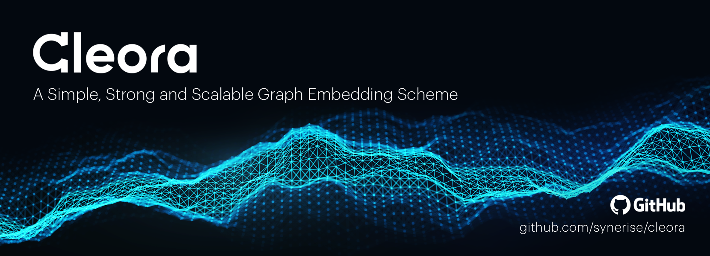

<p align="center">



</p>

<h3 align="center">Graph Embeddings. Blazing Fast.</h3>

<p align="center">
The only graph embedding library that performs <b>all possible random walks in a single matrix multiplication</b>.<br>
No negative sampling. No GPU. No noise. Just fast, deterministic, production-grade embeddings.
</p>

<p align="center">
  <b>240x</b> Faster Than GraphSAGE &nbsp;·&nbsp;
  <b>8</b> Embedding Algorithms + GCN Classifier &nbsp;·&nbsp;
  <b>~5 MB</b> Total Install Size
</p>

<p align="center">
  <a href="https://cleora.ai">Website</a> &nbsp;·&nbsp;
  <a href="https://cleora.ai/docs">Documentation</a> &nbsp;·&nbsp;
  <a href="https://cleora.ai/api">API Reference</a> &nbsp;·&nbsp;
  <a href="https://cleora.ai/benchmarks">Benchmarks</a>
</p>

---

## Achievements

:one:st place at [SIGIR eCom Challenge 2020](https://sigir-ecom.github.io/ecom20DCPapers/SIGIR_eCom20_DC_paper_1.pdf)

:two:nd place and Best Paper Award at [WSDM Booking.com Challenge 2021](http://ceur-ws.org/Vol-2855/challenge_short_3.pdf)

:two:nd place at [Twitter Recsys Challenge 2021](https://recsys-twitter.com/competition_leaderboard/latest)

:three:rd place at [KDD Cup 2021](https://ogb.stanford.edu/paper/kddcup2021/mag240m_SyneriseAI.pdf)

---

## Installation

```bash
pip install pycleora
```

Optional extras:

```bash
pip install pycleora[viz]       # matplotlib for visualization
pip install pycleora[full]      # matplotlib + networkx + tqdm
```

## Quick Start

```python
from pycleora import SparseMatrix, embed, find_most_similar

edges = ["alice item_laptop", "alice item_mouse", "bob item_keyboard"]
graph = SparseMatrix.from_iterator(iter(edges), "complex::reflexive::product")

embeddings = embed(graph, feature_dim=1024, num_iterations=4)

similar = find_most_similar(graph, embeddings, "alice", top_k=5)
for r in similar:
    print(f"{r['entity_id']}: {r['similarity']:.4f}")
```

### Step-by-Step Example

The high-level `embed()` function wraps the Markov propagation loop for convenience. Here's the full manual version, which gives you complete control over the process:

```python
from pycleora import SparseMatrix
import numpy as np
import pandas as pd
import random

customers = [f"Customer_{i}" for i in range(1, 20)]
products = [f"Product_{j}" for j in range(1, 20)]

data = {
    "customer": random.choices(customers, k=100),
    "product": random.choices(products, k=100),
}

df = pd.DataFrame(data)
customer_products = df.groupby('customer')['product'].apply(list).values
cleora_input = map(lambda x: ' '.join(x), customer_products)

mat = SparseMatrix.from_iterator(cleora_input, columns='complex::reflexive::product')

print(mat.entity_ids)

embeddings = mat.initialize_deterministically(1024)

NUM_WALKS = 3   # 3-4 for co-occurrence, 7+ for contextual similarity

for i in range(NUM_WALKS):
    embeddings = mat.left_markov_propagate(embeddings)
    embeddings /= np.linalg.norm(embeddings, ord=2, axis=-1, keepdims=True)

for entity, embedding in zip(mat.entity_ids, embeddings):
    print(entity, embedding)

print(np.dot(embeddings[0], embeddings[1]))
```

### CLI

```bash
pycleora embed --input graph.tsv --output embeddings.npz --dim 1024
pycleora info --input graph.tsv
pycleora similar --input graph.tsv --entity alice --top-k 10
pycleora benchmark --dataset karate_club
```

---

## Key Advantages

### No Negative Sampling
Unlike DeepWalk, Node2Vec, and LINE, Cleora doesn't approximate random walks with negative sampling. It computes **all walks exactly** via matrix multiplication. Less noise, higher accuracy, perfect reproducibility.

### 240x Faster Than GraphSAGE
Zomato reported embedding generation in **under 5 minutes** with Cleora, compared to **20 hours with GraphSAGE** on the same dataset. Rust core with adaptive parallelism makes every CPU cycle count.

### Deterministic Embeddings
Same input always produces the same output. No random seeds, no stochastic variation, no "run it 5 times and average" workflows. Critical for reproducible research and production ML pipelines.

### Heterogeneous Hypergraphs
Natively handles multi-type nodes and edges, bipartite graphs, and hypergraphs. TSV input with typed columns like `complex::reflexive::product`. No graph preprocessing needed.

### ~5 MB, Zero Dependencies
The entire library is ~5 MB. Compare: PyTorch Geometric is 500 MB+, DGL is 400 MB+. Cleora ships as a single compiled Rust extension. No CUDA, no cuDNN, no GPU driver headaches.

### Stable & Inductive
Embeddings are stable across runs and support inductive learning: new nodes can be embedded without retraining the entire graph. Production-ready from day one.

---

## Supported Algorithms

| Algorithm | Type | Description |
|-----------|------|-------------|
| **Cleora** | Spectral / Random Walk | Iterative Markov propagation with L2 normalization — all random walks in one matrix multiplication |
| **ProNE** | Spectral | Fast spectral propagation with Chebyshev polynomial approximation |
| **RandNE** | Random Projection | Gaussian random projection for very fast, approximate embeddings |
| **NetMF** | Matrix Factorization | Network Matrix Factorization — factorizes the DeepWalk matrix explicitly |
| **DeepWalk** | Random Walk | Classic random walk + skip-gram approach |
| **Node2Vec** | Random Walk | Biased random walks with tunable BFS/DFS exploration |
| **HOPE** | Matrix Factorization | High-Order Proximity preserved Embedding |
| **GraRep** | Matrix Factorization | Graph Representations with Global Structural Information |
| **GCN** | Mini-GNN | 2-layer Graph Convolutional Network classifier in pure numpy/scipy — no PyTorch needed |

All algorithms are unified under a single API. Switch between methods by changing one parameter:

```bash
pycleora embed --input graph.tsv --output out.npz --algorithm cleora
pycleora embed --input graph.tsv --output out.npz --algorithm prone
pycleora embed --input graph.tsv --output out.npz --algorithm node2vec
```

### Advanced Embedding Modes

Beyond the standard algorithms, Cleora supports several advanced embedding strategies:

- **Multiscale embeddings** — concatenates embeddings from different iteration depths (e.g. scales `[1, 2, 4, 8]`) to capture both local and global graph structure simultaneously
- **Attention-weighted propagation** — uses softmax-normalized dot-product attention during propagation, dynamically weighting neighbor contributions
- **Supervised refinement** — fine-tunes unsupervised embeddings using positive/negative entity pairs with a triplet margin loss
- **Directed graph embeddings** — handles asymmetric relationships where edge direction matters
- **Weighted graph embeddings** — incorporates edge weights into the propagation step
- **Node feature integration** — initializes embeddings with external features (text, image, numeric) before propagation
- **PCA whitening** — built-in ZCA whitening to decorrelate embedding dimensions and improve downstream task performance

---

## Batteries Included

pycleora ships with a comprehensive set of built-in modules:

| Module | What it does |
|--------|-------------|
| `pycleora.community` | Community detection (Louvain) |
| `pycleora.classify` | MLP and Label Propagation classifiers — no PyTorch needed |
| `pycleora.sampling` | 6 graph sampling methods |
| `pycleora.tuning` | Grid search and random search for hyperparameter tuning |
| `pycleora.compress` | Embedding compression (PQ, scalar quantization) |
| `pycleora.io_utils` | Save/load embeddings (NPZ, CSV, TSV), NetworkX conversion |
| `pycleora.viz` | Embedding visualization (UMAP, t-SNE projections) |
| `pycleora.metrics` | Evaluation metrics for embeddings |
| `pycleora.benchmark` | Compare algorithms with time, memory, and accuracy metrics |
| `pycleora.ensemble` | Combine embeddings from multiple algorithms |
| `pycleora.align` | Embedding alignment across graphs |
| `pycleora.search` | Nearest-neighbor entity search |
| `pycleora.stats` | Graph statistics and degree analysis |
| `pycleora.preprocess` | Graph preprocessing and filtering |
| `pycleora.hetero` | Heterogeneous graph utilities |
| `pycleora.generators` | Synthetic graph generators for testing |
| `pycleora.datasets` | Real-world benchmark datasets (Facebook, Cora, CiteSeer, PubMed, PPI, roadNet-CA, and more) |

See the [full API reference](https://cleora.ai/api) for details on every function and parameter.

---

## Case Study: Zomato

**From 20 hours to under 5 minutes** — powering recommendations for 80M+ users across 500+ cities.

Zomato's ML team needed graph embeddings to power "People Like You" restaurant recommendations. Their initial approach with **GraphSAGE took ~20 hours** just to process customer-restaurant interaction data for a single city region — making it impossible to scale across 500+ cities.

**Pipeline:**
1. **Customer-Restaurant Graph** — Bipartite graph of customer orders and restaurant interactions
2. **Cleora Embeddings** (< 5 minutes) — 197x faster than DeepWalk, no sampling of positive/negative examples
3. **EMDE Density Estimation** — Customer preferences modeled as probability density functions
4. **Production Recommendations** — Restaurant recommendations, search ranking, dish suggestions, and "People Like You" lookalikes

**Results:**

| Metric | Value |
|--------|-------|
| Speed vs DeepWalk | **197x** faster |
| Embedding generation | **< 5 min** |
| Cities scaled to | **500+** |
| GPUs required | **0** |

[Read the full Zomato blog post →](https://www.zomato.com/blog/connecting-the-dots-strengthening-recommendations-for-our-customers-part-two/)

---

## Benchmarks

Benchmarked against **7 competing algorithms** on **5 real-world datasets** (ego-Facebook, Cora, CiteSeer, PubMed, PPI) plus a 2M-node scale test. All datasets are genuine academic benchmarks from SNAP, Planetoid, and DGL. Cleora wins on accuracy on **every single dataset**.

Full interactive benchmark results at [cleora.ai/benchmarks](https://cleora.ai/benchmarks).

### Classification Accuracy

| Dataset | Nodes | Cleora | NetMF | DeepWalk | Node2Vec | HOPE | GraRep | ProNE | RandNE |
|---------|-------|--------|-------|----------|----------|------|--------|-------|--------|
| **ego-Facebook** | 4K | **0.990** | 0.957 | 0.958 | 0.958 | 0.890 | T/O | 0.075 | 0.212 |
| **Cora** | 2.7K | **0.861** | 0.839 | 0.835 | 0.835 | 0.821 | 0.809 | 0.179 | 0.247 |
| **CiteSeer** | 3.3K | **0.824** | 0.810 | 0.806 | 0.806 | 0.740 | 0.756 | 0.189 | 0.244 |
| **PubMed** | 19.7K | **0.879** | OOM | T/O | T/O | T/O | OOM | 0.339 | 0.351 |
| **PPI** | 3.9K | **1.000** | OOM | T/O | T/O | T/O | OOM | 0.023 | 0.073 |

> **Only 3 of 8 algorithms survive at 19.7K nodes.** HOPE, NetMF, GraRep, DeepWalk, and Node2Vec all crash or time out. Cleora achieves perfect accuracy on PPI (50 classes).

### Memory Efficiency

| Dataset | Cleora | Best Competitor | Factor |
|---------|--------|-----------------|--------|
| ego-Facebook (4K) | **22 MB** | 572 MB | 26x less |
| Cora (2.7K) | **14 MB** | 227 MB | 16x less |
| CiteSeer (3.3K) | **16 MB** | 294 MB | 18x less |
| PubMed (19.7K) | **97 MB** | 175 MB | Only 3 survived |
| roadNet-CA (2M) | **4.1 GB** | — | Only Cleora finished |

### Scale Test: roadNet-CA (2 Million Nodes)

2 million nodes. 31 seconds. Every other algorithm crashes with out-of-memory. Cleora is the only library that survives at this scale on a single CPU.

---

## Library Comparison

| Feature | **pycleora 3.2** | PyG | KarateClub | DGL | Node2Vec | StellarGraph |
|---------|:---:|:---:|:---:|:---:|:---:|:---:|
| CPU-only (no GPU needed) | **Yes** | Optional | Yes | Optional | Yes | Optional |
| Rust-powered core | **Yes** | No (C++) | No | No (C++) | No | No (TF) |
| No negative sampling needed | **Yes** | No | No | No | No | No |
| Deterministic output | **Yes** | No | No | No | No | No |
| Node2Vec / DeepWalk | **Built-in** | Yes | Yes | Yes | Yes | Yes |
| GNN classifier (no PyTorch) | **GCN** | Requires PyTorch | No | Requires PyTorch | No | Requires TF |
| Graph sampling | **6 methods** | Yes | No | Yes | No | Yes |
| Hyperparameter tuning | **Grid + Random** | Manual | No | Manual | No | Manual |
| Install size | **~5 MB** | ~500 MB+ | ~15 MB | ~400 MB+ | ~2 MB | ~600 MB+ |
| Actively maintained | **Yes** | Yes | Yes | Yes | Yes | Archived |

---

## Use Cases

- **Recommendation Systems** — Products, content, restaurants, videos
- **Knowledge Graphs** — Entity and relation embeddings
- **Customer Lookalikes** — Find users with similar behavior patterns
- **Entity Resolution** — Match entities across data sources
- **Fraud Detection** — Detect anomalous patterns in transaction graphs
- **Social Networks** — Community detection and link prediction
- **Drug Discovery** — Molecule and protein interaction networks
- **Supply Chain** — Supplier and logistics graph analysis

See [cleora.ai/use-cases](https://cleora.ai/use-cases) for detailed walkthroughs with code examples.

---

## How It Works

1. **Input Data** — Feed edge lists, interaction logs, or knowledge triples. Cleora accepts any TSV with typed columns.
2. **Hypergraph Construction** — Builds a heterogeneous hypergraph where a single edge can connect multiple entities of different types.
3. **Sparse Markov Matrix** — Constructs a sparse transition matrix (99%+ sparse). Rows normalized so each row sums to 1.
4. **Single Matrix Multiplication = All Walks** — One sparse matrix multiplication captures *every possible random walk* of a given length. No sampling, no noise.
5. **L2-Normalized Propagation** — Each iteration replaces every node's embedding with the L2-normalized average of its neighbors. 3-4 iterations for co-occurrence similarity, 7+ for contextual similarity.
6. **Embeddings Ready** — Dense, deterministic embedding vectors for every entity. Same input always yields same output.

---

## Also Used By

**Synerise** — AI/ML platform processing billions of e-commerce events daily. Cleora powers core recommendation and personalization: product embeddings from terabytes of transactions, substitute vs. complement detection, customer segmentation, cold-start solving — all on CPU in minutes.

**Dailymotion** — Video platform with 350M+ monthly visitors. Personalized video recommendations with improved relevance and catalog coverage.

**ML Competitions** — Cleora-powered solutions achieved top placements in KDD Cup 2021, WSDM WebTour 2021, and SIGIR eCom 2020 — beating deep learning approaches on travel, e-commerce, and web recommendation benchmarks.

---

## FAQ

**Q: What should I embed?**

A: Any entities that interact with each other, co-occur or can be said to be present together in a given context. Examples can include: products in a shopping basket, locations frequented by the same people at similar times, employees collaborating together, chemical molecules being present in specific circumstances, proteins produced by the same bacteria, drug interactions, co-authors of the same academic papers, companies occurring together in the same LinkedIn profiles.

**Q: How should I construct the input?**

A: What works best is grouping entities co-occurring in a similar context, and feeding them in whitespace-separated lines using `complex::reflexive` modifier is a good idea. E.g. if you have product data, you can group the products by shopping baskets or by users. If you have urls, you can group them by browser sessions, or by (user, time window) pairs. Check out the usage example above. Grouping products by customers is just one possibility.

**Q: Can I embed users and products simultaneously, to compare them with cosine similarity?**

A: No, this is a methodologically wrong approach, stemming from outdated matrix factorization approaches. What you should do is come up with good product embeddings first, then create user embeddings from them. Feeding two columns e.g. `user product` into cleora will result in a bipartite graph. Similar products will be close to each other, similar users will be close to each other, but users and products will not necessarily be similar to each other.

**Q: What embedding dimensionality to use?**

A: The more, the better, but we typically work from _1024_ to _4096_. Memory is cheap and machines are powerful, so don't skimp on embedding size.

**Q: How many iterations of Markov propagation should I use?**

A: Depends on what you want to achieve. Low iterations (3) tend to approximate the co-occurrence matrix, while high iterations (7+) tend to give contextual similarity (think skip-gram but much more accurate and faster).

**Q: How do I incorporate external information, e.g. entity metadata, images, texts into the embeddings?**

A: Just initialize the embedding matrix with your own vectors coming from a VIT, sentence-transformers, or a random projection of your numeric features. In that scenario low numbers of Markov iterations (1 to 3) tend to work best.

**Q: My embeddings don't fit in memory, what do I do?**

A: Cleora operates on dimensions independently. Initialize your embeddings with a smaller number of dimensions, run Cleora, persist to disk, then repeat. You can concatenate your resulting embedding vectors afterwards, but remember to normalize them afterwards!

**Q: Is there a minimum number of entity occurrences?**

A: No, an entity `A` co-occurring just 1 time with some other entity `B` will get a proper embedding, i.e. `B` will be the most similar to `A`. The other way around, `A` will be highly ranked among nearest neighbors of `B`, which may or may not be desirable, depending on your use case. Feel free to prune your input to Cleora to eliminate low-frequency items.

**Q: Are there any edge cases where Cleora can fail?**

A: Cleora works best for relatively sparse hypergraphs. If all your hyperedges contain some very common entity `X`, e.g. a _shopping bag_, then it will degrade the quality of embeddings by degenerating shortest paths in the random walk. It is a good practice to remove such entities from the hypergraph.

**Q: How can Cleora be so fast and accurate at the same time?**

A: Not using negative sampling is a great boon. By constructing the (sparse) Markov transition matrix, Cleora explicitly performs all possible random walks in a hypergraph in one big step (a single matrix multiplication). That's what we call a single _iteration_. We perform 3+ such iterations. Thanks to a highly efficient implementation in Rust, with special care for concurrency, memory layout and cache coherence, it is blazingly fast. Negative sampling or randomly selecting random walks tend to introduce a lot of noise - Cleora is free of those burdens.

---

## Resources

- **Website**: [cleora.ai](https://cleora.ai)
- **API Reference**: [cleora.ai/api](https://cleora.ai/api)
- **Benchmarks**: [cleora.ai/benchmarks](https://cleora.ai/benchmarks)
- **Whitepaper**: ["Cleora: A Simple, Strong and Scalable Graph Embedding Scheme"](https://arxiv.org/abs/2102.02302)
- **GitHub**: [github.com/BaseModelAI/cleora](https://github.com/BaseModelAI/cleora)
- **PyPI**: [pypi.org/project/pycleora](https://pypi.org/project/pycleora/)

## Cite

Please cite [our paper](https://arxiv.org/abs/2102.02302) (and the respective papers of the methods used) if you use this code in your own work:

```
@article{DBLP:journals/corr/abs-2102-02302,
  author    = {Barbara Rychalska, Piotr Babel, Konrad Goluchowski, Andrzej Michalowski, Jacek Dabrowski},
  title     = {Cleora: {A} Simple, Strong and Scalable Graph Embedding Scheme},
  journal   = {CoRR},
  year      = {2021}
}
```

## License

MIT licensed. See [LICENSE](LICENSE) for details.

## Contributing

Pull requests are welcome. For major changes, please open an issue first. Contact: cleora@synerise.com
