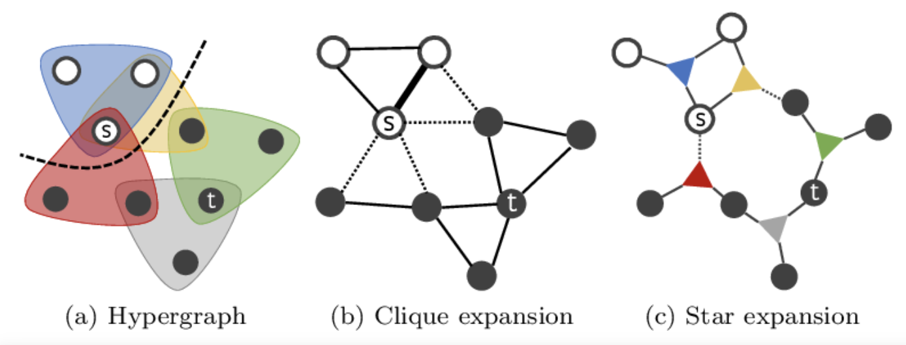
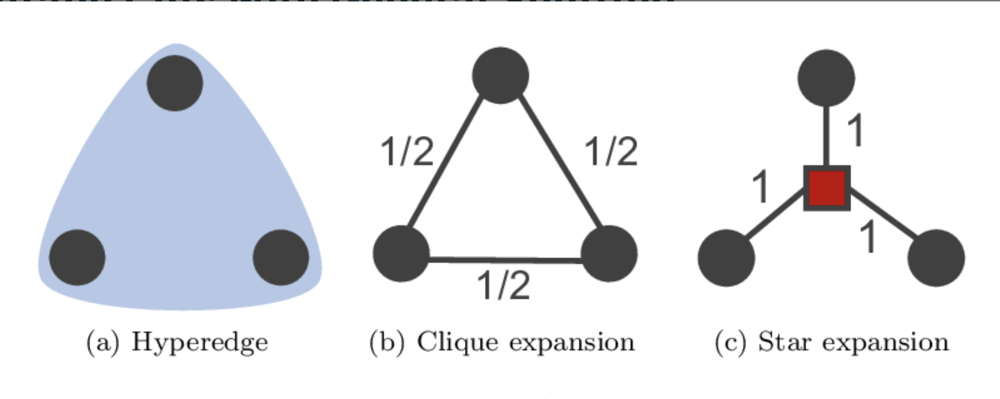

.. _algorithms:

Hypergraph expansion methods
============================================================= 

**Hypergraph Expansion** - Cleora needs to break down all existing hyperedges into edges as the algorithm relies on the pairwise notion of node transition. Hypergraph expansion to graph is done using two alternative strategies:

Clique Expansion
---------------------------

- Each hyperedge is transformed into a clique - a subgraph where each pair of nodes is connected with an edge. Space/time complexity of this approach is:

.. math::

   O(|V| \times d + |E| \times k^2) 

where: E is the number of hyperedges. 

With the usage of cliques the number of created edges can be significant but guarantees better fidelity to the original hyperedge relationship. We apply this scheme to smaller graphs.

Star Expansion
---------------------------
- Extra node is introduced which links to the original nodes contained by a hyperedge. Space/time complexity of this approach is:

.. math::

   (|V|+|E|) \times d + |E|k)

Here we must count in the time and space needed to embed an extra entity for each hyperedge, but we save on the number of created edges, which would be only k for each hyperedge. This approach is suited for large graphs.
