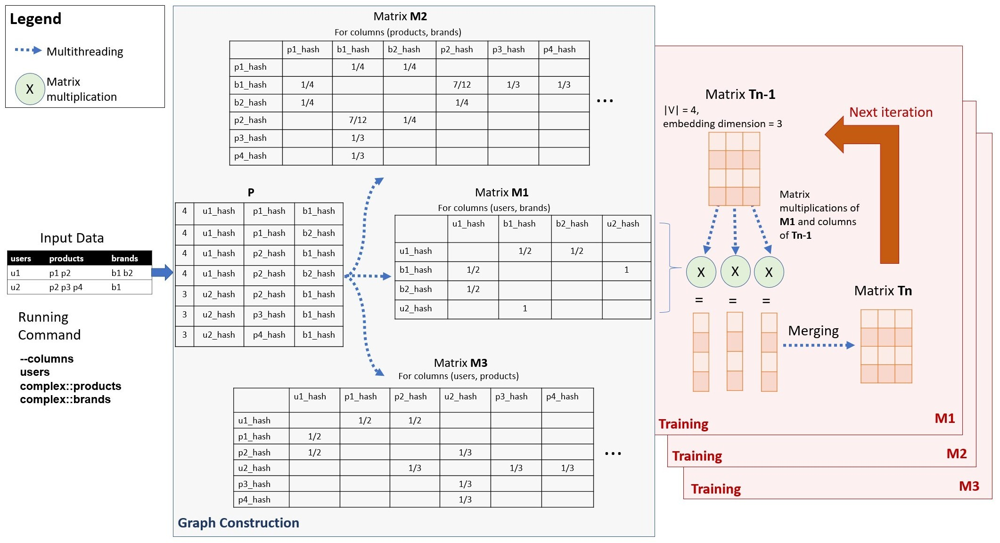

.. _graph-creation:

Graph Creation
=========================

Cleora as a tool
----------------------

Cleora is built as a multi-purpose "just embed it" tool, suitable for many different data types and formats. Our tool ingests a relational table of rows representing a typed and undirected heterogeneous hypergraph, which can contain multiple:

- typed categorical columns
- typed categorical array columns

Based on the column format specification, Cleora performs:

- Star decomposition of hyper-edges
- Creation of pairwise graphs for all pairs of entity types
- Embedding of each graph
- The final output of Cleora consists of multiple files for each (undirected) pair of entity types in the table.

Those embeddings can then be utilized in a novel way thanks to their dim-wise independence property, which is described further below.

Graph construction
------------------------

Graph construction starts with the creation of a helper matrix *P* object as a regular 2-D Rust array, which is built according to the selected 
expansion method. An example involving clique expansion is presented in Figure - a Cartesian product (all combinations) of all columns is created. 
Each entity identifier from the original input file is hashed with `xxhash <https://cyan4973.github.io/xxHash/>`_ - a fast and efficient hashing method. 
We hash the identifiers to store them in a unified, small data format. From the first line of our example:

.. math::

   U1\:P1\:P2\:B1\:B2

we get 4 combinations produced by the Cartesian product:

.. math::

   [4,\:U1hash,\:P1hash,\:B1hash] \\
   [4,\:U1hash,\:P1hash,\:B2hash] \\
   [4,\:U1hash,\:P2hash,\:B1hash] \\
   [4,\:U1hash,\:P2hash,\:B2hash]

At the beginning we insert the total number of combinations (in this case 4). Then we add another 3 rows representing combinations from the second row of the input.

Subsequently, for each relation pair from matrix `P` we create a separate matrix `M` as a `SparseMatrix` struct (the matrices `M` will usually hold mostly zeros). 
Each matrix `M` object is produced in a separate thread in a stepwise fashion. The rows of matrix `P` object are broadcasted to all matrix `M` objects, 
and each matrix `M` object reads the buffer selecting the appropriate values, updating its content.
For example, M3 (users and products) reads the hashes from indexes 1 and 2. After reading the first vector:

.. math::

     [4,\:U1hash,\:P1hash,\:B1hash]

the edge value for **U1hash <-> P1hash** equals 1/4 (1 divided by the total number of Cartesian products). After reading the next vector:

.. math::

    [4,\:U1hash,\:P1hash,\:B2hash]

    
the edge value for **U1hash <-> P1hash** updates to 1/2 (1/4 + 1/4). After reading the next two, we finally have:

**U1hash <-> P1hash** = 1/2

**U1hash <-> P2hash** = 1/2

Sparse Matrix
---------------------

For maximum efficiency we created a custom implementation of a sparse matrix data structure - the SparseMatrix struct. It follows the sparse matrix coordinate format (COO). Its purpose is to save space by holding only the coordinates and values of nonzero entities.

Embedding is done in 2 basic steps: graph construction and training.

Let's assume that the basic configuration of the program looks like this:

    .. code-block:: bash

         --input files/samples/edgelist_2.tsv --columns="users complex::products complex::brands" --dimension 3 --number-of-iterations 4

Every SparseMatrix is created based on the program argument **--columns**. For our example, there will be three SparseMatrix'es that will only read data from the columns:

- users and brands by M1
- products and brands by M2
- users and products by M3
