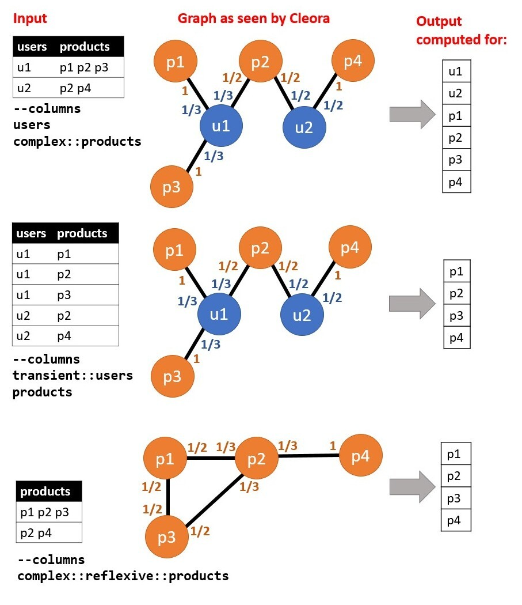

.. _running:

Running configuration
====================== 

This page details how to use the cleora run command to define the embedding resources at runtime.

Synopsis
--------

**cleora** [*options 2*] <*params 1*> [*options 2*] <*params 2*> ...

Run options 
--------------

- input

Using input param: *--input* or *-i* 

Param description: A parameter that defines path for input file. You can use also absolute path or relative path.
     

- file type

Using file type param: *--type* or *-t*

Param description: This parameter is responsible for defining the input file extension to the algorithm. Cleora supports two kinds of input files .tsv (tab-separated values) and .json.

- dimension

Using dimension param: *--dimenstion* or *-d* 

Param description: Embedding dimension size.

- number of iterations

Using number of iterations param: *--dimenstion* or *-d*

param Description: Set maximum number of iterations.

- columns

Using columnns param: *--columns* or *-c* 

Param description: Set column names (max. 12), with modifiers from list: [transient::, reflexive::, complex::]

.. list-table::
   :widths: 20 80
   :header-rows: 1

   * - Modifiers
     - Description
   * - transient
     - The field is virtual - it is considered during embedding process, no entity is written for the column
   * - reflexive   
     - The field is composite, containing multiple entity identifiers separated by space in TSV or an array in JSON
   * - complex  
     - The field is reflexive, which means that it interacts with itself, additional output file is written for every such field
   * - ignore
     - The field is ignored, no output file is written for the field

Allowed combinations of modifiers are:  
    - `transient`
    - `complex`
    - `transient::complex`
    - `reflexive::complex`

For TSV datasets containing composite fields (categorical array), multiple items within a field are then separated by space.

The specification of an input format is as follows:

    .. code-block:: none

        --columns="[column modifiers, ::]<column_name> [column modifiers, ::]<column_name> [column modifiers, ::]<column_name> ..."

Combinations which don't make sense are:

.. list-table::
   :widths: 40 80
   :header-rows: 1

   * - Modifiers
     - Description
   * - reflexive
     - This would represent an identity relation
   * - transient::reflexive   
     - This would generate no output
   * - reflexive::transient::complex
     - This would generate no output

Picture below representation how works column modifiers:

- relation name

Using relation param: *--relation-name* or *-r*

Param description: Name of the relation, for output filename generation.

- prepend field name

Using prepend field name param: *--relation-name* or *-r*

Param description: Prameter that responsible for prepending field name to entity in output.

- log every n

Using log every n params : *--log-every-n* or *-l*

Param description: Set log output for every N lines

- in memory embedding calculation

Using log in memory embedding calculation param: *--in-memory-embedding-calculation* or *-e*

Param description: Parameter that responsible for using calculate embeddings in memory or with memory-mapped files. Default is on (setting -e 0). If you want off use -e 1.

-output dir

Using output dir param: *--output-dir* or *-o* 

Param description: Set output directory for files with embeddings.

-output format

Using output format param: --output-format* or *-o*  

Param Description: A parameter that defines the format of the output file. Possible output format are textfile (.txt) and numpy (.npy)

Examples Cleora run configuration
---------------------------------

Remember before you will first run cleora training (after download binary file from repository) to set execute file permission using *chmod +x*  

.. code-block:: bash

  
   chmod +x cleora
   ./cleora -i files/samples/edgelist_sample.tsv 
            --columns="complex::reflexive::a b complex::c" 
            -d 128 
            -n 5 
            --relation-name=test_realation_name
            -p 0

